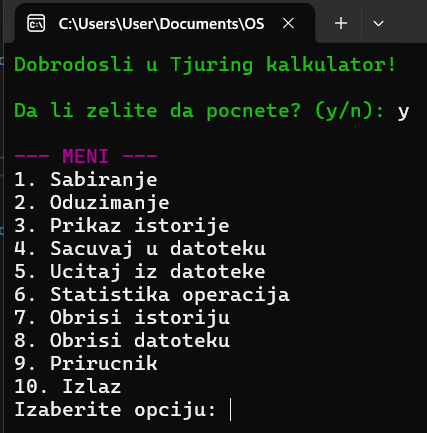
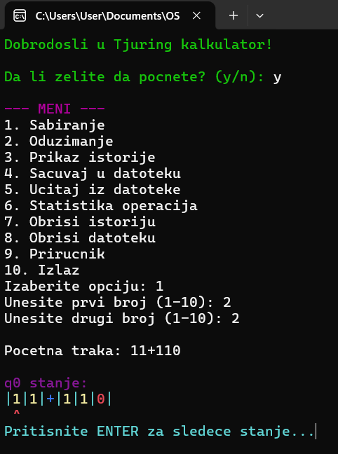

# student-portfolio
Studentkinja softverskog inženjerstva zainteresovana za razvoj aplikacija, veb tehnologije i dizajn korisničkog interfejsa.

---

## Simulacija kalkulatora zasnovana na Tjuringovoj mašini

Implementacija simulacije sabiranja i oduzimanja korišćenjem principa Tjuringove mašine.

**Tehnologije:**
- C
- Povezane liste
- Rad sa fajlovima

---

## Edukativna aplikacija

Aplikacija za organizaciju pripreme ispita sa Pomodoro tajmerom.

**Tehnologije:**
- WPF app
- SQL Server

---

## Veb prodavnica za knjižaru

Veb aplikacija za pregled i organizaciju knjižarskog kataloga.

**Tehnologije:**
- HTML
- CSS

---

## Kolekcija mini igara

Kolekcija mini igara inspirisana animiranom serijom.

**Tehnologije:**
- Java
- WindowBuilder

## Dostignuća

- Član reprezentacije Srbije u karateu
- Vicešampionka države
- Preko 150 osvojenih medalja
- 5. mesto na svetskom prvenstvu
- 1. mesto na državnom takmičenju iz 2D/3D grafike
- 6. mesto na međunarodnom takmičenju
